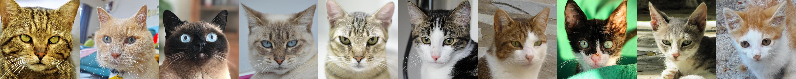
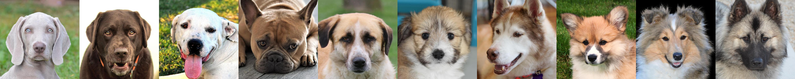
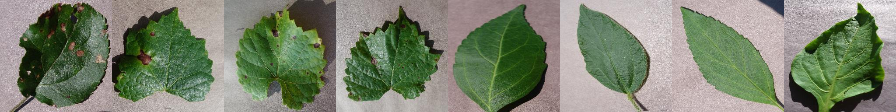

# LARGE: Latent-Based Regression through GAN Semantics

<p align="center">

</p>

<a href="https://arxiv.org/abs/2107.11186"></a>
[](http://colab.research.google.com/github/YotamNitzan/LARGE/blob/main/latent_regression.ipynb)


### [[Project Website](https://yotamnitzan.github.io/LARGE/)] [[Google Colab](http://colab.research.google.com/github/YotamNitzan/LARGE/blob/main/latent_regression.ipynb)] [[Paper](https://arxiv.org/abs/2107.11186)]

LARGE: Latent-Based Regression through GAN Semantics

[Yotam Nitzan<sup>*</sup>](https://yotamnitzan.github.io), [Rinon Gal<sup>*</sup>](https://rinongal.github.io/), [Ofir Brenner](https://scholar.google.com/citations?user=iLLlWr8AAAAJ), and [Daniel Cohen-Or](https://danielcohenor.com/)

Abstract: We propose a novel method for solving regression tasks using few-shot or weak supervision. At the core of our method is the fundamental observation that GANs are incredibly successful at encoding semantic information within their latent space, even in a completely unsupervised setting. For modern generative frameworks, this semantic encoding manifests as smooth, linear directions which affect image attributes in a disentangled manner. These directions have been widely used in GAN-based image editing. We show that such directions are not only linear, but that the magnitude of change induced on the respective attribute is approximately linear with respect to the distance traveled along them. By leveraging this observation, our method turns a pre-trained GAN into a regression model, using as few as two labeled samples. This enables solving regression tasks on datasets and attributes which are difficult to produce quality supervision for. Additionally, we show that the same latent-distances can be used to sort collections of images by the strength of given attributes, even in the absence of explicit supervision. Extensive experimental evaluations demonstrate that our method can be applied across a wide range of domains, leverage multiple latent direction discovery frameworks, and achieve state-of-the-art results in few-shot and low-supervision settings, even when compared to methods designed to tackle a single task.

<!-- 
## Citation

If you find our code useful, please consider citing our paper:

```
@article{Nitzan2020FaceID,
  title={Face identity disentanglement via latent space mapping},
  author={Yotam Nitzan and A. Bermano and Yangyan Li and D. Cohen-Or},
  journal={ACM Transactions on Graphics (TOG)},
  year={2020},
  volume={39},
  pages={1 - 14}
}
```
-->

## Sorting Examples

<p align="center">
Black to Blond hair <br> 
</p>
<p align="center">
Age <br>  
</p>
<p align="center">
Fur Fluffiness <br> 
</p>
<p align="center">
Sickness <br> 
</p>

## Credits

**StyleGAN2 implementation:**  
https://github.com/rosinality/stylegan2-pytorch  
Copyright (c) 2019 Kim Seonghyeon  
License (MIT) https://github.com/rosinality/stylegan2-pytorch/blob/master/LICENSE 

**StyleGAN2 Models:**
https://github.com/NVlabs/stylegan2-ada/
https://github.com/NVlabs/stylegan2
Copyright (c) 2021, NVIDIA Corporation
[Nvidia Source Code License-NC](https://nvlabs.github.io/stylegan2/license.html)

**pSp model and implementation:**   
https://github.com/eladrich/pixel2style2pixel  
Copyright (c) 2020 Elad Richardson, Yuval Alaluf  
License (MIT) https://github.com/eladrich/pixel2style2pixel/blob/master/LICENSE

**e4e model and implementation:**   
https://github.com/omertov/encoder4editing
Copyright (c) 2021 omertov  
License (MIT) https://github.com/omertov/encoder4editing/blob/main/LICENSE

**ReStyle model and implementation:**   
https://github.com/yuval-alaluf/restyle-encoder/
Copyright (c) 2021 Yuval Alaluf  
License (MIT) https://github.com/yuval-alaluf/restyle-encoder/blob/main/LICENSE

## Acknowledgement

We would like to thank Raja Gyres, Yangyan Li, Or Patashnik, Yuval Alaluf, Amit Attia, Noga Bar and Zonzge Wu for helpful comments. We additionaly thank Zonzge Wu for the trained e4e models for AFHQ cats and dogs.

## Citation
If you use this code for your research, please cite our papers.
```
@misc{nitzan2021large,
      title={LARGE: Latent-Based Regression through GAN Semantics}, 
      author={Yotam Nitzan and Rinon Gal and Ofir Brenner and Daniel Cohen-Or},
      year={2021},
      eprint={2107.11186},
      archivePrefix={arXiv},
      primaryClass={cs.CV}
}
```
